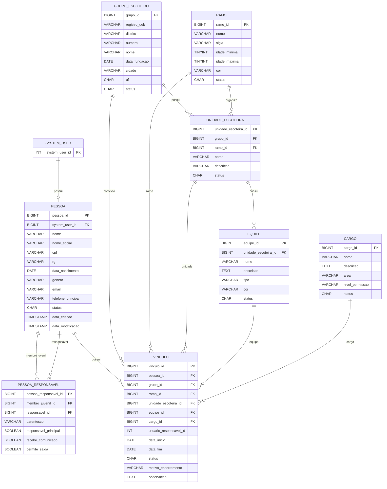

# Diagrama Físico do Core

```mermaid
erDiagram

    PESSOA {
        BIGINT pessoa_id PK
        BIGINT system_user_id FK
        VARCHAR nome
        VARCHAR nome_social
        VARCHAR cpf
        VARCHAR rg
        DATE data_nascimento
        VARCHAR genero
        VARCHAR email
        VARCHAR telefone_principal
        CHAR status
        TIMESTAMP data_criacao
        TIMESTAMP data_modificacao
    }

    PESSOA_RESPONSAVEL {
        BIGINT pessoa_responsavel_id PK
        BIGINT membro_juvenil_id FK
        BIGINT responsavel_id FK
        VARCHAR parentesco
        BOOLEAN responsavel_principal
        BOOLEAN recebe_comunicado
        BOOLEAN permite_saida
    }

    GRUPO_ESCOTEIRO {
        BIGINT grupo_id PK
        VARCHAR registro_ueb
        VARCHAR distrito
        VARCHAR numero
        VARCHAR nome
        DATE data_fundacao
        VARCHAR cidade
        CHAR uf
        CHAR status
    }

    RAMO {
        BIGINT ramo_id PK
        VARCHAR nome
        VARCHAR sigla
        TINYINT idade_minima
        TINYINT idade_maxima
        VARCHAR cor
        CHAR status
    }

    UNIDADE_ESCOTEIRA {
        BIGINT unidade_escoteira_id PK
        BIGINT grupo_id FK
        BIGINT ramo_id FK
        VARCHAR nome
        VARCHAR descricao
        CHAR status
    }

    EQUIPE {
        BIGINT equipe_id PK
        BIGINT unidade_escoteira_id FK
        VARCHAR nome
        TEXT descricao
        VARCHAR tipo
        VARCHAR cor
        CHAR status
    }

    CARGO {
        BIGINT cargo_id PK
        VARCHAR nome
        TEXT descricao
        VARCHAR area
        VARCHAR nivel_permissao
        CHAR status
    }

    VINCULO {
        BIGINT vinculo_id PK
        BIGINT pessoa_id FK
        BIGINT grupo_id FK
        BIGINT ramo_id FK
        BIGINT unidade_escoteira_id FK
        BIGINT equipe_id FK
        BIGINT cargo_id FK
        INT usuario_responsavel_id
        DATE data_inicio
        DATE data_fim
        CHAR status
        VARCHAR motivo_encerramento
        TEXT observacao
    }

    SYSTEM_USER {
        INT system_user_id PK
    }

    SYSTEM_USER ||--o| PESSOA : "possui"

    PESSOA ||--o{ PESSOA_RESPONSAVEL : "membro juvenil"
    PESSOA ||--o{ PESSOA_RESPONSAVEL : "responsavel"

    GRUPO_ESCOTEIRO ||--o{ UNIDADE_ESCOTEIRA : "possui"

    RAMO ||--o{ UNIDADE_ESCOTEIRA : "organiza"

    UNIDADE_ESCOTEIRA ||--o{ EQUIPE : "possui"

    PESSOA ||--o{ VINCULO : "possui"

    GRUPO_ESCOTEIRO ||--o{ VINCULO : "contexto"

    RAMO ||--o{ VINCULO : "ramo"

    UNIDADE_ESCOTEIRA ||--o{ VINCULO : "unidade"

    EQUIPE ||--o{ VINCULO : "equipe"

    CARGO ||--o{ VINCULO : "cargo"
```